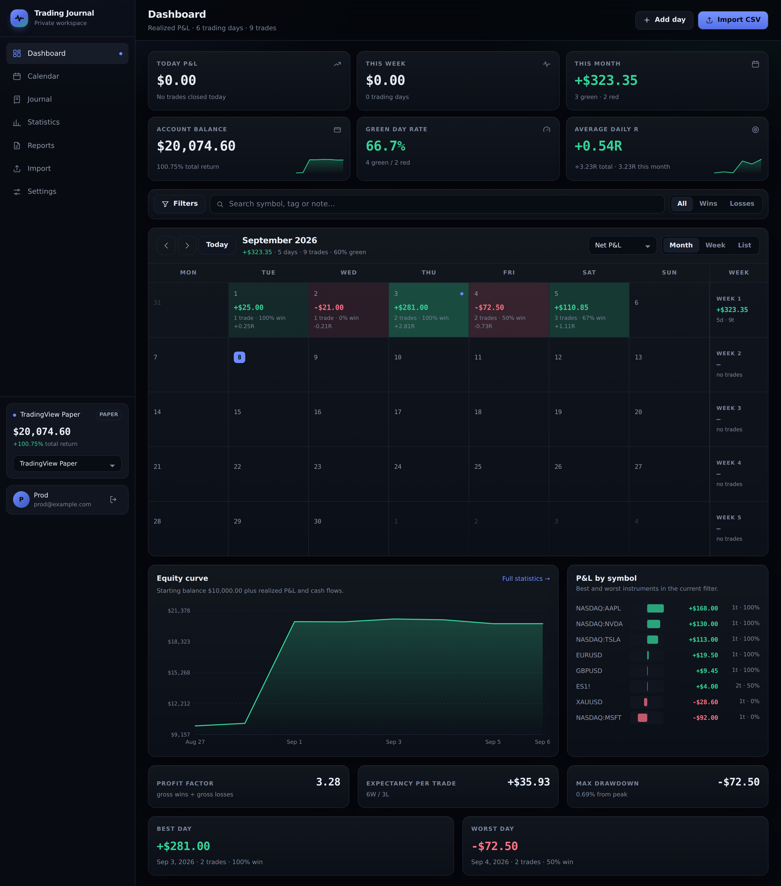
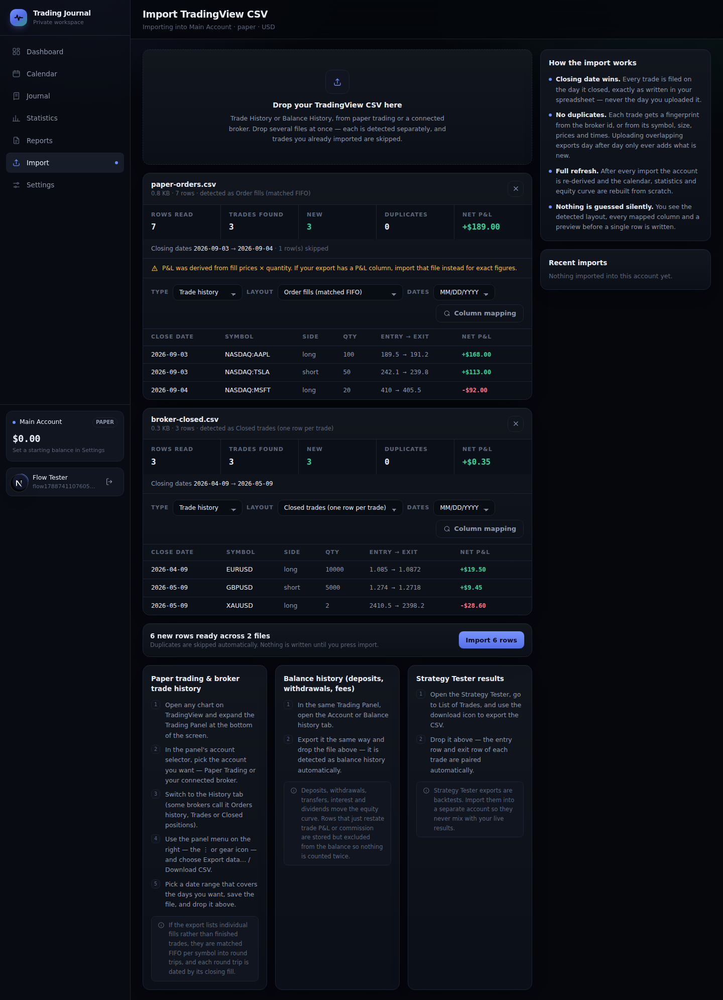
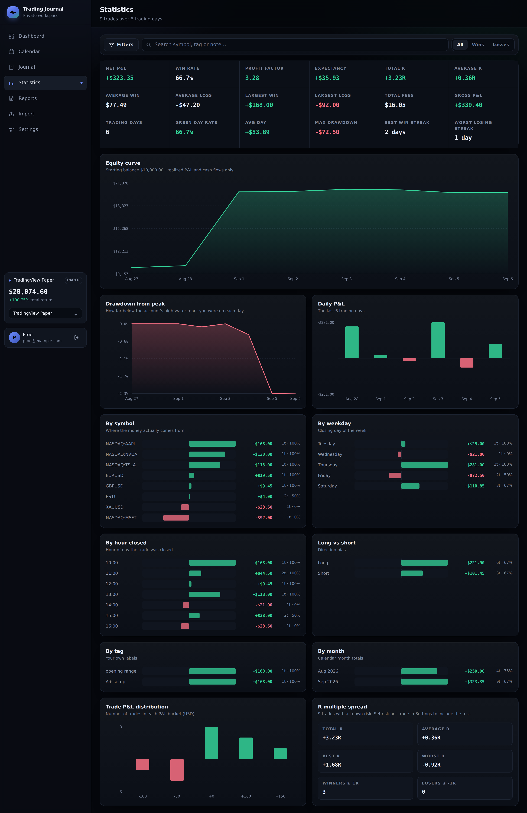

# Trading Journal

A private, dark-mode trading journal built around a **monthly P&L calendar**.
Import your TradingView exports, journal the day, and let the numbers show the
pattern.

Every account is completely separate: sign-ups are open so the site can be
shared publicly, but one user can never see another user's trades.



<sub>The dashboard: KPI tiles, the P&L calendar with weekly totals, equity curve and per-symbol breakdown.</sub>

---

## What it does

**Calendar-first dashboard**
Each day is coloured by realized P&L and shows trade count, win rate and R
multiple. Switch the calendar between **net P&L, R multiple, trade count and
win rate**, and between **month, week and list** views. Weekly totals sit in a
column beside the grid, and clicking any day opens a drawer with that day's
trades, journal entry and quick-entry form.

**TradingView CSV import that actually understands the file**
Drop one or many exports. Each is analysed on its own and you see the detected
layout, the mapped columns, a row preview and how many rows are new *before*
anything is written. Three trade layouts are recognised automatically:

| Layout | Typical source | How it is read |
| --- | --- | --- |
| Closed trades | Broker "History" / "Closed positions" | One row per trade, using its P&L column |
| Entry / exit rows | Strategy Tester → List of Trades | Rows are paired by trade number |
| Order fills | Paper Trading order history | Fills matched **FIFO per symbol** into round trips |

Balance history (deposits, withdrawals, fees, interest, dividends) is detected
separately and feeds the equity curve.



<sub>Two files analysed at once — detected layout, mapped columns, row preview
and duplicate counts, all before anything is written.</sub>

**The three rules that keep the data honest**

- **The spreadsheet's closing date wins.** A trade is filed on the day it
  closed, exactly as written in the file — never the day you uploaded it, and
  never shifted into the viewer's timezone.
- **Repeat uploads never duplicate.** Every trade gets a fingerprint from the
  broker's own id when there is one, and otherwise from its symbol, size,
  prices and timestamps. Re-uploading yesterday's export on top of today's adds
  only what is new; the overlap is reported as duplicates and skipped.
- **Every import fully refreshes the account.** After a commit the stored
  derived fields are recomputed and the calendar, statistics and equity curve
  are rebuilt from scratch.

**Everything else**

- Daily journal entries — headline, notes, mood, discipline rating, tags
- Tags and notes on individual trades, editable inline — including on imported
  ones, which is what makes the tag filter and the per-tag breakdown useful
- Statistics: expectancy, profit factor, drawdown, streaks, R spread, and
  breakdowns by symbol, weekday, hour closed, direction, tag and month
- Equity curve and drawdown-from-peak charts
- Filters (date range, symbol, side, tags, wins/losses, free text) that apply
  across the dashboard, calendar, statistics and reports — and to exports
- CSV export of trades, daily summaries, journal entries and balance history
- Manual entry: add individual trades, or log a whole day's totals at once
- Multiple trading accounts (paper / live / backtest) kept completely apart
- Account settings: currency, starting balance, and the risk per trade that
  defines 1R



**No demo data.** A new account starts empty, with one blank trading account.

---

## Running it locally

Requires Node.js 20 or newer.

```bash
npm install
cp .env.example .env.local     # optional; the defaults work as-is
npm run dev                    # http://localhost:3000
```

Open the app, create an account, and import a CSV. The database file is created
automatically at `data/journal.db`.

```bash
npm run build && npm start     # production build
npm run typecheck              # TypeScript, no emit
npm test                       # unit tests
```

### Tests

`npm test` runs the suite with Node's built-in test runner. It covers the parts
where a quiet mistake would corrupt your numbers rather than crash the app:

- **`csv`** — delimiter sniffing, quoted fields, title rows before the header,
  European decimals, parenthesised negatives, and every date shape brokers
  emit, including the rule that a wall-clock time never shifts into another
  timezone
- **`tradingview`** — column mapping (a "Take Profit" column must never become
  the P&L column; `Profit USD` must beat `Profit %`), detection of all three
  trade layouts, FIFO matching including a partial fill split across two
  entries, and dedupe keys staying stable when a later export appends rows
- **`metrics`** — day rollups, win rate excluding breakeven trades, R
  precedence, profit factor, drawdown, streaks, the equity curve, and the
  filters

Two bugs were caught by writing them: a weekday-stripper that ate three-letter
month names, so `Sep 14, 2026` failed to parse at all; and a journal note on a
day you did not trade counting as a trading day.

---

## Deploying

The app stores everything in SQLite through libSQL, which gives you two
deployment shapes that speak identical SQL.

### A server with a disk (Render, Railway, Fly.io, a VPS, Docker)

Point `DATABASE_URL` at a file on a **persistent volume** so the journal
survives redeploys:

```
DATABASE_URL=file:/data/journal.db
```

A `Dockerfile` is included and already declares `/data` as a volume:

```bash
docker build -t trading-journal .
docker run -p 3000:3000 -v trading-journal-data:/data trading-journal
```

### Serverless (Vercel, Netlify)

Serverless filesystems are not persistent, so use a hosted libSQL database
([Turso](https://turso.tech) has a free tier). Create a database, then set:

```
DATABASE_URL=libsql://your-database-name.turso.io
DATABASE_AUTH_TOKEN=your-token
```

Nothing else changes — the schema is created on first request either way.

### Environment variables

| Variable | Default | Purpose |
| --- | --- | --- |
| `DATABASE_URL` | `file:./data/journal.db` | SQLite file path, or a libSQL/Turso URL |
| `DATABASE_AUTH_TOKEN` | — | Auth token, for hosted libSQL only |
| `ALLOW_SIGNUPS` | `true` | Set to `false` to close registration once your own account exists |

Deploy behind HTTPS. Session cookies are set `Secure` automatically when
`NODE_ENV=production`.

---

## Privacy and security

- Passwords are hashed with **scrypt** and a per-user random salt; they are
  never stored or logged in any recoverable form.
- Sessions are random 256-bit tokens stored **hashed** in the database, handed
  out in `HttpOnly`, `SameSite=Lax` cookies, and expire after 30 days.
  Changing your password invalidates every session.
- **Every query is scoped by user id.** There is no endpoint that returns
  another user's trades, and signed-out requests to the API get a 401.
- Sign-in and sign-up are rate limited per IP.
- Only the sign-in and sign-up pages are indexable; the journal itself is
  excluded in `robots.txt`.
- You can export everything as CSV, clear a single account's data, or delete
  your entire journal — password-confirmed — from **Settings**.

---

## How the numbers are worked out

- **Realized only.** Open positions are never counted as P&L. When a fills
  export leaves a position open, the import says so and leaves it out.
- **Net P&L** is what the broker reports when the file has a P&L column.
  Commission and swap are normalised to a positive cost and subtracted when
  only a gross figure is present. For FIFO-matched fills, P&L is derived as
  `(exit − entry) × matched quantity`, with fees allocated pro rata — the
  import warns you when it does this, since a file with a real P&L column is
  always more accurate.
- **Win rate** is wins ÷ (wins + losses); breakeven trades are excluded from
  the denominator.
- **1R** is a trade's own entry-to-stop distance × size when the export
  provides a stop, and otherwise the risk per trade configured in Settings.
  Changing that setting re-derives every R immediately.
- **Balance** is `starting balance + cash flows + realized P&L`. Deposits,
  withdrawals, transfers, adjustments, interest and dividends count as cash
  flows. Balance rows that merely restate trade P&L or commission are stored
  but excluded, so nothing is counted twice.
- **Drawdown** is measured against the running high-water mark of that balance.
- **A journal note is not a trading day.** Writing about a day you sat out
  marks the day on the calendar but never enters the trading-day count, the
  green-day rate or the equity curve.
- **Manual day entries carry only a date and a total.** A date range narrows
  them; a filter that asks about a symbol, side, tag or result excludes them,
  because a whole-day entry has none of those attributes to match.

---

## Project layout

```
src/
  app/
    (auth)/            sign-in and registration
    (app)/             dashboard, calendar, journal, statistics, reports,
                       import, settings — all behind the session check
    api/               JSON endpoints; every one resolves the user first
  components/          calendar, day drawer, import wizard, charts, forms
  lib/
    db.ts              libSQL client + schema migration
    auth.ts            scrypt hashing, sessions, registration
    csv.ts             delimiter sniffing, RFC4180 parsing, loose number
                       and date parsing for real broker exports
    tradingview.ts     column mapping, layout detection, FIFO matching
    import.ts          duplicate detection, writing, full refresh
    metrics.ts         day rollups, summary stats, equity curve, breakdowns
tests/               unit tests for csv, tradingview and metrics
```

Charts are hand-drawn SVG and the icons are inline, so the only runtime
dependencies are Next.js, React and the libSQL client.
